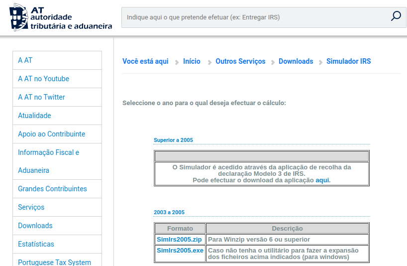
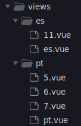
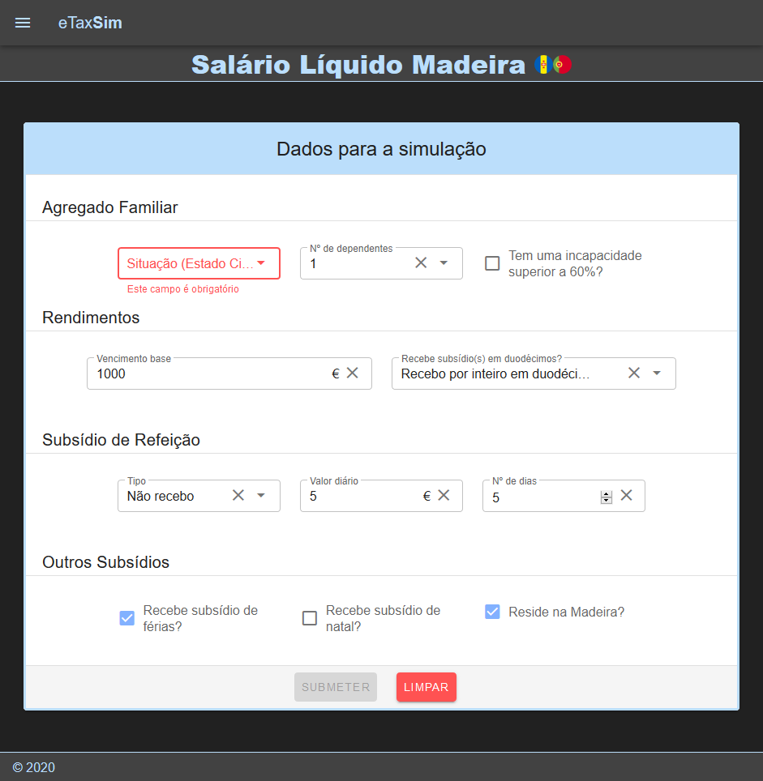

Introdução
==========

Este relatório visa documentar a implementação de um sistema **eTaxSim**
que permite o cálculo facilitado através simulações de
pagamentos/recebimentos ao/do Estado com base no salário.

Em primeiro lugar, será identificado o problema a ser resolvido,
juntamente com soluções existentes na atualidade para esse mesmo
problema. Daí, será descrita em detalhe a solução para o mesmo, desde o
seu conceito até toda a sua concretização (base de dados, back-end e
front-end), juntamente com a enumeração dos padrões de desenho
envolvidos.

Problema
========

Nos dias correntes, com a complexidade inerente ao calculo do salário
liquido, motivado por taxas variáveis, existe a necessidade de efetuar
diversos tipos de cálculos para determinar pagamentos/recebimentos ao/do
Estado, notando que existe uma constante atualização e não uniformização
dos valores ao longo do território. Além disso, note-se que a
documentação existente acerca de todos estes cálculos é complexa de
intender para um leitor mais leigo, sendo que, por vezes, torna-se mesmo
necessário nos dirigirmos aos estabelecimentos próprios para fins de
esclarecimento.

Mais concretamente, por exemplo, quando entramos no mundo do trabalho,
não temos grande conhecimento sobre grande parte dos termos por detrás
do mesmo. Como tal, ao recebermos uma primeira proposta de emprego,
podemos não estar tão despertos a detalhes que poderão vir a ser
pertinentes (nomeadamente, o cálculo do salário líquido - que por si só
já requer uma quantidade substancial de entendimento do procedimento por
detrás do mesmo). Não só isso como também quando se trata de uma
proposta de mudança de emprego (para outra empresa), por vezes não se
torna claro qual a melhor opção a tomar (devido à complexidade da
comparação entre ambas as ofertas em mão).

Como podemos ver, temos uma grande necessidade da implementação deste
tipo de sistemas, pelo que pretendemos evitar burocracias e compreender
facilmente este tipo de cálculos.

*Background*
============

Atualmente, já existem algumas (poucas) soluções para o problema
mencionado. Contudo, mesmo estas normalmente encontram-se desatualizadas
ou incompletas.

Por exemplo, temos o caso do Portal das Finanças, que contém um único
simulador (simulador de IRS). Todavia, este não encontra-se atualizado
desde 2005 (apesar de determinadas mudanças que têm surgindo nas regras
do cálculo do IRS desde então). Não obstante a isso, este mesmo
simulador acaba por não ser muito prático na medida em que requer
instalação num computador Windows (tal como outras possíveis
dependências).

Da mesma forma, para fins de simulações, também podemos recorrer à
plataforma Doutor-Finanças, na qual temos uma lista mais completa de
simuladores.

No entanto, esta solução é algo restritiva na medida em que a plataforma
não se foca apenas nas simulações, podendo causar alguma distração do
objetivo inicial. Para complemento, a nossa plataforma visa
disponibilizar um serviço mais vasto, incluindo a simulação por diversos
países, que, dado à globalização e ao contexto sócio-demográfico
português, torna-se cada vez pais pertinente.

Solução
=======

A solução a ser apresentada acabará por ser uma solução mais robusta,
mais configurável e mais escalável a fim de facilitar tanto as
simulações por parte dos utilizadores em qualquer país (seguindo as
regras de cada país) como também facilitar a modificação futura (e/ou
adição incremental de novos tipos de simulações) no sistema. Visa também
disponibilizar futuramente um conjunto de ferramentas de analise dos
dados recolhidos pelas diversas simulações. Para facilitar este último
ponto, nesta solução iremos recorrer a uma abordagem mais
*metadata-driven*.

Em traços gerais, a solução consistirá numa aplicação Web na qual o
utilizador poderá efetuar uma dada simulação através do front-end. Após
a submissão dos dados de entrada por parte do utilizador, esses mesmos
dados serão enviados para o back-end (API) que tratará de efetuar a
simulação propriamente dita e devolver o resultado da mesma ao
utilizador final. Além disso, o back-end tratará de utilizar a base de
dados para fins de configurações e logs das simulações.

Base de dados
-------------

Para este tema, foi utilizada uma base de dados relacional **MySQL**. No
geral, nesta podemos encontrar 4 categorias de tabelas: tabelas de
**configuração** (de determinadas variáveis do sistema), tabelas de
**logs**, tabelas **auxiliares** de consulta (para determinadas
simulações) e tabelas de **registo** (de determinados dados submetidos
no sistema).

A base de dados montada pode ser representada da seguinte forma:

Em primeiro lugar, no que toca à configuração, através das tabelas
**Country** e **Region**, é possível configurar quais os países (e as
suas regiões) a serem incluídos no mesmo (e disponibilizados no
front-end). Além disso, recorrendo às tabelas **StrategyByCountry** e
**StrategyByCountryByRegion**, podemos assignar a cada país o seu
conjunto de simulações (estratégias) que podem ser efetuadas, notando
que cada região poderá ter uma determinada variante de uma simulação
(estratégia) presente no país (com a ajuda da segunda tabela). Com base
nas tabelas de configuração referentes às estratégias (**Strategy**,
**ParamByStrategy**, **StrategyParamRule**, **ParamAllowedValues**,
**RuleAllowedValues**), cada estratégia terá um conjunto associado de
parâmetros, pelo que os mesmos podem ter restrições (seja a nível de
valores permitidos, como também a nível de limites mínimos e máximos (se
aplicável)).

Relativamente às tabelas de logs (**SimulationLog** e
**SimulationLogParams**), nestas serão armazenadas as informações
relativas às simulações efetuadas no sistema (quais os parâmetros
introduzidos e qual o resultado da mesma).

Da mesma forma, em relação às tabelas auxiliares, foram disponibilizadas
tabelas para fins de consulta ao efetuar determinadas simulações (ex.:
no cálculo do salário líquido, existem tabelas a serem consultadas que
determinarão qual a taxa de IRS aplicada).

Por fim, também foram disponibilizadas tabelas de registo (a serem
utilizadas em trabalho futuro) que possibilitarão o registo de
determinada informação adicional introduzida no sistema (ex.: introdução
da empresa e cargo a que se aplicaria a simulação do cálculo do salário
líquido).

Sucintamente, a base de dados pode ser descrita da seguinte forma:

  |**Nome da tabela**|                   **Descrição/Objetivo**|
  |------------------------------------| ----------------------------------------------------------------------------------|
  |Country|                              |Configuração - Países|
  |Region                               |Configuração - Regiões|
  |Strategy                             |Configuração - Simulações|
  |ParamByStrategy                      |Configuração - Simulações - Parâmetros|
  |StrategyParamRule                    |Configuração - Parâmetros - Regras|
  |RuleAllowedValues                    |Configuração - Valores permitidos|
  |ParamAllowedValues                   |Configuração - Parâmetros - Valores permitidos|
  |StrategyByCountry                    |Configuração - Países - Simulações|
  |StrategyByCountryByRegion            |Configuração - Regiões - Simulações|
  |SimulationLog                        |Logs - Simulações|
  |SimulationLogParam                   |Logs - Simulações (parâmetros introduzidos)|
  |*\_\_CALC\_PT\_IRS\_TRAB\_DEP\_\_*   |*Tabela auxiliar - Cálculo da taxa de IRS (com base no trabalho dependente)*|
  |*\_\_CALC\_PT\_IRS\_PENS\_\_*        |*Tabela auxiliar - Cálculo da taxa de IRS (com base nos rendimentos de pensões)*|
  |Role                                 |Registo - Roles (cargos) numa dada empresa|
  |Company                              |Registo - Empresas|
  |Sector                               |Configuração - Setores|
  |*\_\_EFMigrationHistory*             |*Tabela gerada pelo back-end (para fins de migrações)*|

Back-end
--------

A criação do *back-end* (API), foi feita com base no Padrão Arquitetural
*Model View Controller (MVC)*, sendo que para isto, recorremos ao
***ASP.NET Core MVC Web API 2.2***.

Para a ligação à base de dados e todas as ações associadas à mesma foi
utilizado o ***Entity Framework***, permitindo desta forma a conversão
dos objectos da base de dados para objetos *.NET* e vice versa,
facilitando desta forma a gestão da mesma.

Outra mais-valia que esta framework oferece são as **migrações**. Desta
forma conseguimos através da criação dos modelos criar a nossa base de
dados, que poderá ser igualmente replicada em diversos sistemas. Tanto
para a criação em si, como para futuros *updates* estruturais basta-nos
executar o seguinte comando
`dotnet ef migrations add {nome da migração}` para criarmos a migração
em si, e esta irá conter todas as alterações a serem aplicadas na base
de dados. Dessa forma, para a aplicação das migrações, podemos recorrer
à execução do comando `dotnet ef database update`.

### *Core*

No contexto do *core* deste tema, foram implementados determinados
padrões de desenho, nomeadamente **Strategy**, **Factory**, **Proxy** e
**Adapter**, tal como podemos conferir na seguinte imagem.

#### Padrões utilizados

-   **Factory** - Utilizado para isolar toda a lógica de gestão e
    instanciação da estratégia a ser usada.

-   **Strategy** - Utilizado para encapsular o comportamento por detrás
    de cada simulação (que pode ser determinado em *runtime*). Desta
    forma, sempre que surgir a necessidade de adicionar uma simulação ao
    sistema, ao nível do *back-end* apenas temos de implementar uma nova
    *Strategy*.

-   **Proxy** - Utilizado para efetuar as validações necessárias aos
    dados de entrada da simulação (por exemplo, verificar a falta de
    parâmetros, verificar os valores introduzidos, entre outras).

-   **Adapter** - Utilizado para a preparação dos dados introduzidos
    pelo utilizador para que possam ser enviados para o processo de
    simulação propriamente dito.

### API

#### Classes

Para fins da montagem da API, neste sistema encontram-se implementadas
classes para esse intuito, pelo que conterão as diversas operações CRUD
respetivas de cada entidade (métodos GET, POST, PUT, DELETE), seguindo a
seguinte estrutura:

#### Principais rotas

Para além de todas as outras rotas da API que nos permitem aceder aos
dados existentes na base de dados, existem duas rotas fundamentais:

-   **Obter as estratégias para o país e região selecionados** : Apenas
    temos de enviar o identificados do país e da região selecionados no
    mapa para a rota
    `./StrategyByCountries/country/region/{countryId}/{regionId}` e
    iremos receber a informação sobre as mesmas.

-   **Efetuar a simulação** : Após ter sido preenchido o formulário,
    basta enviar esses mesmos dados para a rota
    `./strategies/{strategyId}/{countryId\}/{regionId}/evaluate`, sendo
    que no seu corpo deve ser enviado cada parâmetro e o seu valor, na
    seguinte estrutura `{parameterName : parameterValue}`.

Front-end
---------

No que toca ao *front-end*, de um ponto de vista geral, foram usadas as
*frameworks* **Vue**, **Vuetify** e **amCharts**.

{height=".2\\linewidth"}

Em traços gerais, o front-end será composto por um mapa (renderizado
conforme as configurações presentes a nível da base de dados - no que
toca aos países, regiões, \...) no qual o utilizador poderá escolher o
país e região cuja simulação pretende efetuar. Posto isto, conforme a
sua seleção, a partir daí o utilizador poderá efetuar a simulação que
desejar (novamente, conforme a configuração na base de dados). Ou seja,
geralmente, o fluxo do seu funcionamento poderá ser ilustrado da
seguinte forma:

Em termos da construção das vistas relativas às simulações propriamente
ditas, temos dois tipos: os **ecrãs de seleção** (nos quais o utilizador
poderá selecionar a simulação a ser efetuada, com base na região) e os
**formulários de simulação** (nos quais o utilizador poderá preencher o
mesmo, efetuar a simulação e observar o seu resultado). Relativamente à
sua organização, estas encontram-se dispostas em diretorias por país,
sendo que a view com o nome idêntico ao próprio país corresponde ao ecrã
de seleção, e as restantes views correspondem aos ecrãs com os
formulários destinados para as simulações (pelo que se encontra o
respetivo id da simulação no nome da mesma).

Felizmente, o front-end encontra-se preparado para facilmente aceitar as
necessidades que forem surgindo, na medida em que basta serem
construídas as views respetivas aos formulários (com o id da estratégia
respetiva) dentro da diretoria correspondente às views do país a que
pertencem, e todo o sistema irá adaptar-se de imediato.

Como adicionar uma nova simulação?
----------------------------------

Para criarmos um novo tipo de simulação, basta adicionarmos as
configurações necessárias na base de dados tal como os seus dados mestre
(nomeadamente nome, descrição, classe que contém a sua implementação), o
conjunto de parâmetros associados (e possíveis regras/restrições) e os
países/regiões onde se enquadram.

Ao nível do *back-end*, através do padrão de desenho *Strategy*, apenas
temos de implementar a nova estratégia para esta nova simulação.

Da perspetiva do *front-end*, apenas temos de criar a *view* para esta
nova simulação na diretoria do país correspondente e efetuar os pedidos
ao *back-end*.

Conclusão e *future work*
=========================

Em suma, aqui foi apresentada uma solução para o problema descrito na
medida em que ultrapassa a complexidade de determinados
cálculos/pagamentos ao/do Estado e possibilita a fácil simulação dos
mesmos. Mais concretamente, é uma aplicação que nos permite efetuarmos
determinadas simulações consoante as especificações a nível do país (ou
mesmo a nível de região). Em primeiro lugar, é composto por uma base de
dados preparada em MySQL, que interliga todas as componentes deste
sistema - desde países e regiões até às próprias simulações (e toda a
sua configuração derivada). Da mesma forma, este sistema também é
composto por uma API implementado em C\# que encarrega-se de toda a
lógica de todas as operações envolvidas. Não só isso como também é
composto por um front-end no qual o utilizador pode facilmente navegar e
efetuar a simulação que pretende.

Para concluir, podemos constatar que esta solução traz mais dinamismo
que as outras soluções apresentadas, na medida em que traz uma
facilidade de uso e acesso (pelo facto de ser uma aplicação Web) e pelo
facto de que esta é mais escalável e configurável, possibilitando a
facilitada aplicação deste sistema para qualquer país (e região, caso
exista especificidade a esse nível).

Em termos do desenho deste sistema, foi possível a implementação de
determinados princípios de desenho, como o **Adapter** (de forma a
uniformizar e preparar os dados introduzidos pelo utilizador a fim de
efetuar a respetiva simulação), o **Proxy** (de forma a validar esses
mesmos dados de entrada), o **Strategy** (para permitir em *runtime* a
determinação do comportamento a ser adotado para as simulações) e a
**Factory** (de modo a encapsular a lógica de instanciação para as
simulações).

Contudo, não estando finalizado, este sistema ainda contém algum
trabalho futuro. Assim sendo, os pontos a destacar são os seguintes:

-   Criação de um *backoffice* para toda a configuração e mapeamento por
    detrás do sistema

-   Aprofundar o *approach* *metadata-driven* (tanto no *front-end* como
    no *back-end*) - mais dinamismo (p.ex. as *views* no *front-end*
    poderiam ser totalmente construídas de forma inerente com base no
    *metadata*)

-   Transpor a aplicação Web para uma APP Mobile (via Apache *Cordova*,
    por exemplo)

-   Permitir registo de utilizadores (adicionando funcionalidades como
    um histórico de simulações e/ou gestão de resultados)

-   Permitir ligação dos dados introduzidos a uma dada empresa e cargo
    nessa empresa (se aplicável - p.ex. no cálculo do salário líquido)

Referencias
=========================

*Desenho e Implementação de Software*,
https://moodle.cee.uma.pt/course/view.php?id=61

Martin Fowler, *Avoiding Repetition, IEEE Software Volume 18, Issue 1*

Martin Fowler, *The Importance of Being Closed, IEEE Software Volume 18,
Issue 3*

Rebecca J. Worfs-Brock, *Characterizing Classes, IEEE Software Volume
23, Issue 2*

Martin Fowler, *Reducing Coupling, IEEE Software Volume 18, Issue 4*

Rebecca J. Worfs-Brock, *Explaining Your Design, IEEE Software Volume
23, Issue 6*

Martin Fowler, *To Be Explicit, IEEE Software Volume 18, Issue 6*

Rebecca J. Worfs-Brock, *Toward Design Simplicity, IEEE Software Volume
24, Issue 2*
